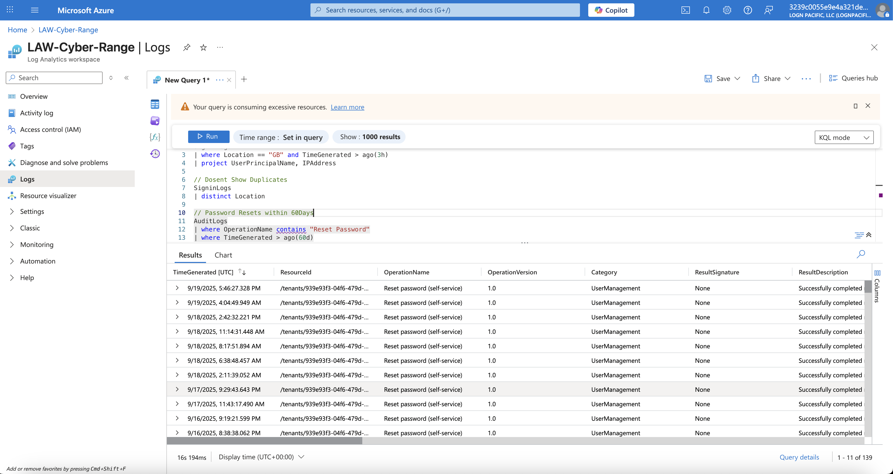

# 📊 KQL Query Practice – Azure Log Analytics (Microsoft Sentinel)

This project showcases my hands-on practice using **Kusto Query Language (KQL)** inside **Azure Log Analytics Workspace**, performing queries on **SigninLogs** and **AuditLogs** to analyze user activity and security events.  

By learning how to write and optimize KQL queries, I’m building skills essential for **SOC Analysts** and **Security Engineers** working in **Microsoft Sentinel**.

---

## 🚀 Project Overview

This lab demonstrates how to:
- Filter and query log data using **KQL**
- Monitor **sign-in activity** and **password resets**
- Work with **time-based filters**, **logical operators**, and **projections**
- Identify **unique locations** and **recent security operations**

---

## 🧠 Queries Practiced

### 🔹 Sign-ins from the UK (Last 3 Hours)
```kql
SigninLogs
| where Location == "GB" and TimeGenerated > ago(3h)
| project UserPrincipalName, IPAddress
```
✅ **Purpose:** Displays all sign-in events in the past 3 hours where the location is **Great Britain**.  
🔍 **Columns:** `UserPrincipalName`, `IPAddress`

---

### 🔹 Distinct Sign-in Locations
```kql
SigninLogs
| distinct Location
```
✅ **Purpose:** Lists all **unique geographic locations** where sign-ins have occurred.  
🧭 **Use Case:** Quickly identify logins from unexpected or unusual countries.

---

### 🔹 Password Resets (Past 60 Days)
```kql
AuditLogs
| where OperationName contains "Reset Password"
| where TimeGenerated > ago(60d)
```
✅ **Purpose:** Finds all **password reset** events within the last **60 days**.  
🧠 **Use Case:** Monitor for potential account compromise attempts or self-service resets.

---

## 🧰 Tools Used
- **Microsoft Sentinel**
- **Azure Log Analytics Workspace**
- **Kusto Query Language (KQL)**

---

## 🧠 Skills Practiced
- 🔹 Writing and combining `where` filters  
- 🔹 Using logical operators (`and`, `contains`)  
- 🔹 Time filters with `ago()`  
- 🔹 Selecting columns with `project`  
- 🔹 Deduplicating with `distinct`  
- 🔹 Querying across multiple log tables

---

## 📸 Screenshot



*(Screenshot shows results for SigninLogs and AuditLogs queries in Log Analytics Workspace.)*

---

## 🧾 Key Takeaway
This exercise builds a strong foundation in **KQL**, enabling effective **incident triage**, **user behavior analysis**, and **security monitoring** inside Microsoft Sentinel — a core skillset for any **Blue Team** or **SOC Analyst**.
